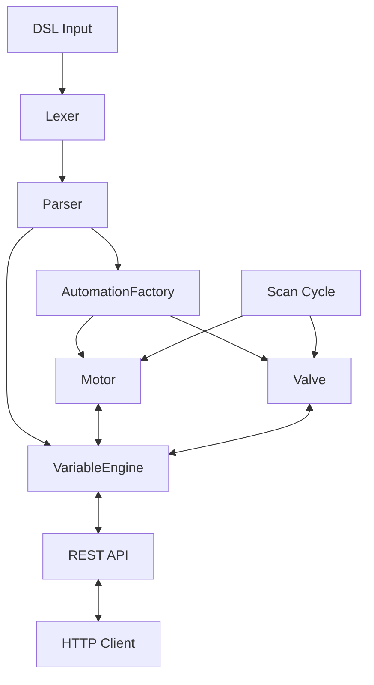

# axMini

[](https://github.com/Naereen/StrapDown.js/blob/master/LICENSE)


## About

axMini is a lightweight soft-PLC backend written in C++20. It features its own DSL, a thread-safe variable engine, and a scan cycle. Together, these elements demonstrate the core architecture of an industrial automation system.



## Build & Quickstart

### Prerequisites

- `cmake` 3.25+
- GCC 13+ / Clang 16+

### Build

```bash
git clone --recurse-submodules https://github.com/Gwynspring/axMini.git
cd axMini
cmake -B build
cmake --build build
```

### Run

To start the engine run the following command in the terminal:

```bash
./build/axMini
```

### API Examples

Open up two terminal windows. In one window run:

```bash
./build/axMini
```

In the second window, read a variable:

```bash
curl http://localhost:8080/variables/input_test
# {"name":"input_test","value":42,"variable_typ":"Input"}
```

To update a variable:

```bash
curl -X PUT http://localhost:8080/variables/input_test \
     -H "Content-Type: application/json" \
     -d '{"value": 99}'
# {"value":99}

curl http://localhost:8080/variables/input_test
# {"name":"input_test","value":99,"variable_typ":"Input"}
```

## What I Learned

This project was built as a structured learning exercise, using AI-assisted mentoring to explore C++20 concepts, CMake architecture, and industrial automation patterns.

## License

MIT
