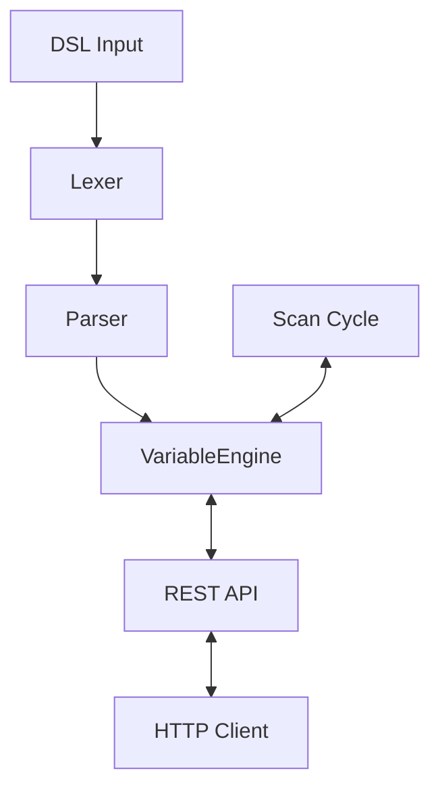

# axMini

## About

axMini is a lightweight soft-PLC backend written in C++20. It features its own DSL, a thread-safe variable engine, and a scan cycle. Together, these elements demonstrate the core architecture of an industrial automation system.

The extensible architecture was prioritized, with the lexer, parser, and engine being distinctly separate from one another. The addition of a new DSL command is met with a modification of the lexer and parser alone, with no effect on the engine.



## Core Components

### VariableEngine

The VariableEngine uses `std::unordered_map` for O(1) average access time by variable name, and `std::variant<int, float, bool>` to represent typed values without inheritance or void pointers. All public methods are protected by a `std::mutex` to guarantee thread safety.

### Lexer

The Lexer takes a `std::string` as input and transforms it into a stream of typed tokens using a single-pass index-based loop for efficient character-by-character processing.

### Parser

The Parser receives a list of tokens, validates the sequence against the DSL grammar and builds a list of `VarDeclaration` nodes.

The Parser uses an Early Return pattern instead of nested conditionals, making the grammar explicit and easy to extend.

### Scan Cycle

The scan cycle is designed to emulate the deterministic execution cycle of a real PLC. A programmable logic controller (PLC) does not execute its logic in an event-driven manner. Rather, it operates in a fixed cycle that involves reading all inputs, executing the logic, and setting all outputs. This ensures that the behavior of real-time systems is predictable.

In axMini, the scan cycle runs in a dedicated `std::jthread` alongside the HTTP server, with the VariableEngine protected by a `std::mutex` to prevent race conditions.

## Build & Quickstart

### Prerequisites

- `cmake` 3.25+
- GCC 13+ / Clang 16+

### Build

```bash
git clone --recurse-submodules https://github.com/Gwynspring/axMini.git
cd axMini
cmake -B build
cmake --build build
```

### Run

To start the engine run the following command in the terminal:

```bash
./build/axMini
```

### API Examples

Open up two terminal windows. In one window run:

```bash
./build/axMini
```

In the second window, read a variable:

```bash
curl http://localhost:8080/variables/input_test
# {"name":"input_test","value":42,"variable_typ":"Input"}
```

To update a variable:

```bash
curl -X PUT http://localhost:8080/variables/input_test \
     -H "Content-Type: application/json" \
     -d '{"value": 99}'
# {"value":99}

curl http://localhost:8080/variables/input_test
# {"name":"input_test","value":99,"variable_typ":"Input"}
```

## What I Learned

*Coming soon.*

## License

MIT
