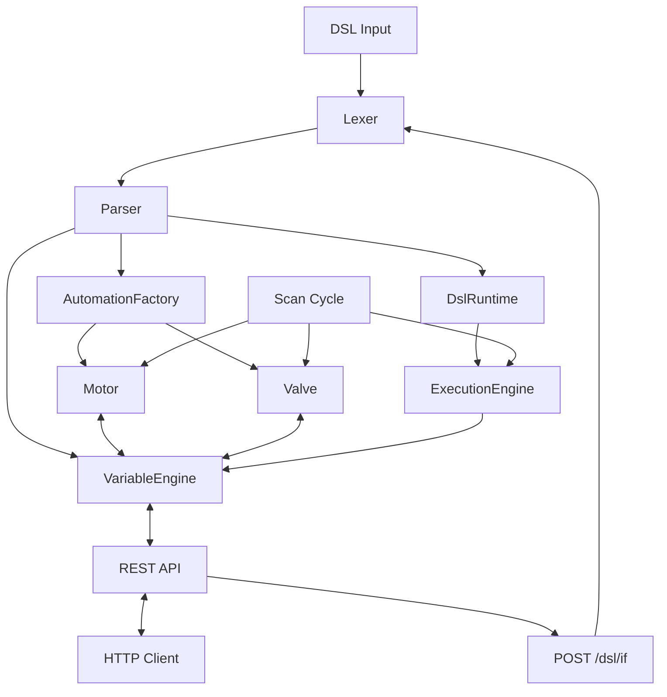

# axMini

[](https://github.com/Naereen/StrapDown.js/blob/master/LICENSE)


## About

axMini is a lightweight soft-PLC backend written in C++20. It features its own DSL, a thread-safe variable engine, and a scan cycle. Together, these elements demonstrate the core architecture of an industrial automation system.


```mermaid
graph TD
    DSL_Input[DSL Input] --> Lexer
    Lexer --> Parser
    Parser --> VariableEngine
    Parser --> DslRuntime
    DslRuntime --> ExecutionEngine
    Parser --> AutomationFactory
    AutomationFactory --> Motor
    AutomationFactory --> Valve
    Motor <--> VariableEngine
    Valve <--> VariableEngine
    VariableEngine <--> REST_API[REST API]
    ExecutionEngine --> VariableEngine
    Scan_Cycle[Scan Cycle] --> Valve
    Scan_Cycle[Scan Cycle] --> Motor
    Scan_Cycle[Scan Cycle] --> ExecutionEngine
    REST_API <--> HTTP_Client[HTTP Client]
    REST_API --> POST_DSL[POST /dsl/if]
    POST_DSL[POST /dsl/if] --> Lexer
```

## Build & Quickstart

### Prerequisites

- `cmake` 3.25+
- GCC 13+ / Clang 16+

### Build

```bash
git clone --recurse-submodules https://github.com/Gwynspring/axMini.git
cd axMini
cmake -B build
cmake --build build
```

#### 1\. Start server 

```bash
./build/src/axMini
```

When no Json file for storing variables and statements is specified a file is created by default.

```bash
❯ ./src/axMini
# [2026-04-20 22:47:00.800] [axLogger] [info] ../data/state.json
```

---

#### 2\. Check initial state

```bash
curl http://localhost:8080/variables/motor_1.speed
# {"name":"motor_1.speed","value":0,"variable_typ":"Output"}

curl http://localhost:8080/variables/valve_1.is_open
# {"name":"valve_1.is_open","value":false,"variable_typ":"Output"}

curl http://localhost:8080/variables/motor_1.running
# {"name":"motor_1.running","value":false,"variable_typ":"Output"} 
```

---

#### 3\. Write variables 

```bash
# Set motor speed to 150 
curl -X PUT http://localhost:8080/variables/motor_1.speed \
     -H "Content-Type: application/json" \
     -d '{"value": 150}'
# {"value":150}

# Start motor
curl -X PUT http://localhost:8080/variables/motor_1.running \
     -H "Content-Type: application/json" \
     -d '{"value": true}'
# {"value":true}
```

---

#### 4\. Check values after writing

```bash
curl http://localhost:8080/variables/motor_1.speed
# {"name":"motor_1.speed","value":150,"variable_typ":"Output"}

# Valve should be true (because IF motor_1.speed > 100)
curl http://localhost:8080/variables/valve_1.is_open
# {"name":"valve_1.is_open","value":true,"variable_typ":"Output"}
```

---

#### 5\. Add DSL at runtime

```bash
curl -X POST http://localhost:8080/dsl/if \
     -d 'IF motor_1.speed < 200 THEN motor_1.running = false; END_IF;'
# {"status": "ok"}

curl http://localhost:8080/variables/valve_1.is_open
# {"name":"valve_1.is_open","value":false,"variable_typ":"Output"}
```

---

#### 6\. Save 

```bash
# First check states before saving again
curl http://localhost:8080/variables/motor_1.speed
# {"name":"motor_1.speed","value":150,"variable_typ":"Output"}

curl http://localhost:8080/variables/valve_1.is_open
# {"name":"valve_1.is_open","value":false,"variable_typ":"Output"}

# Then save the current state
curl -X POST http://localhost:8080/save
# {"status": "saved"}

# The logger should track the safe command via http
[2026-04-20 22:57:53.309] [axLogger] [info] Saving to: /path/of/your/install/axMini/data/state.json

# Check file
cat data/state.json
```

---

#### 7\. New start test

```bash
# Stop server
# Ctrl+C

# Start server again
./build/src/axMini

# Check state 
curl http://localhost:8080/variables/motor_1.speed
# {"name":"motor_1.speed","value":150,"variable_typ":"Output"}

curl http://localhost:8080/variables/valve_1.is_open
# {"name":"valve_1.is_open","value":true,"variable_typ":"Output"}
```

## What I Learned

This project was built as a structured learning exercise, using AI-assisted mentoring to explore C++20 concepts, CMake architecture, and industrial automation patterns.

## License

MIT
